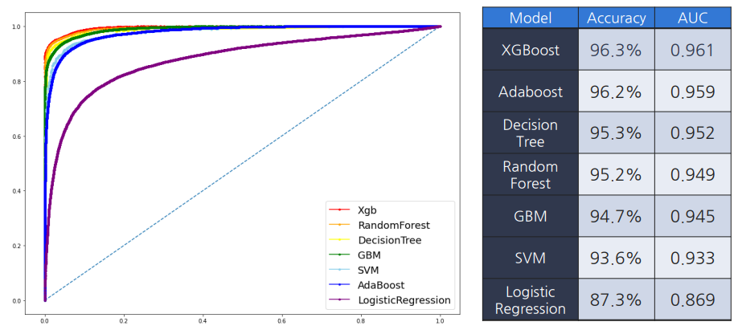
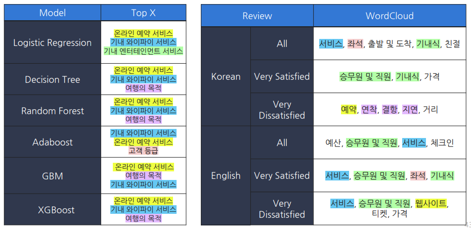

## [데이터마이닝] 팀프로젝트
### 2021.4.10 - 2021.6.17

* 항공사 승객 만족도 data 분석(출처: https://www.kaggle.com/datasets/binaryjoker/airline-passenger-satisfaction)
    * EDA, 데이터 전처리 수행 후 모델링
    * 변수 중요도 확인 -> 만족도 요인 분석

* 국내 항공사 리뷰 데이터 Crawling(출처: TripAdvisor https://www.tripadvisor.co.kr/)
    * Chromedriver, selenium 활용
    * 텍스트 데이터 전처리
    * 워드 클라우드

* 파일 설명
    * data: 한국어/영어 크롤링 파일(이스타, 제주,  진에어, 티웨이)
    * Model
        * ConfusionMatrix_ROC.ipynb: 모델별 혼동행렬 및 ROC 커브 비교
        * DecisionTree.ipynb: 의사결정나무 모델
        * Logistic_Regression.ipynb: 로지스틱 모델
        * randomForest.ipynb: 랜덤포레스트 및 앙상블(Ada, Xgb, Gbm) 모델
        * SVM.ipynb: SVM 모델
    * WordCloud
        * WordCloud_en.ipynb: 영어 1점/5점 워드클라우드
        * WordCloud_en_all.ipynb: 영어 전체 워드클라우드
        * WordCloud_ko.ipynb: 한국어 1점/5점 워드클라우드
        * WordCloud_ko_all.ipynb: 한국어 전체 워드클라우드

* 분석 결과
    

    